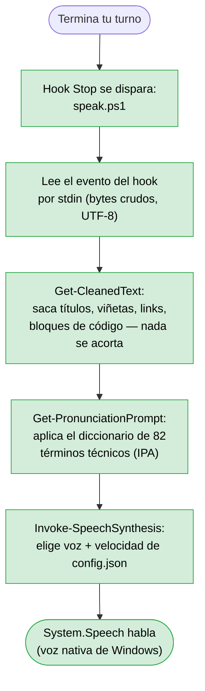
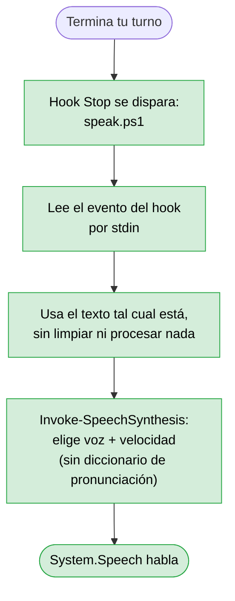
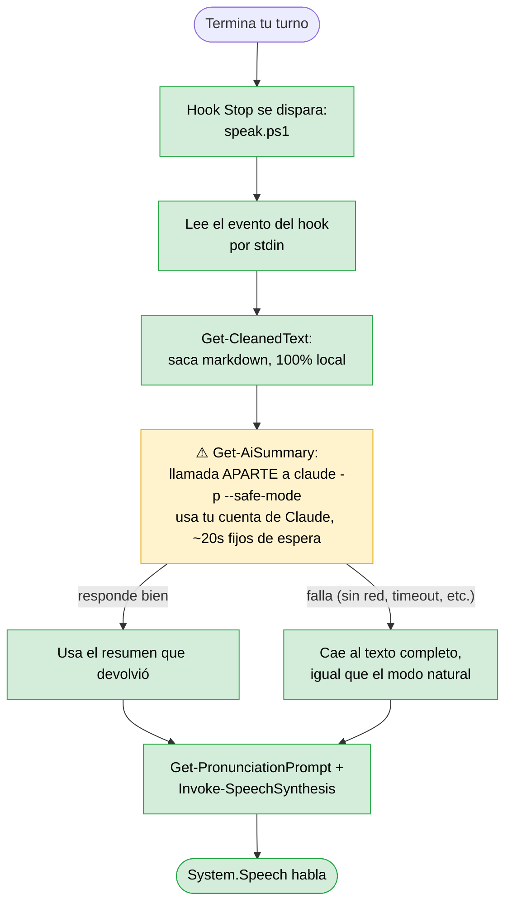
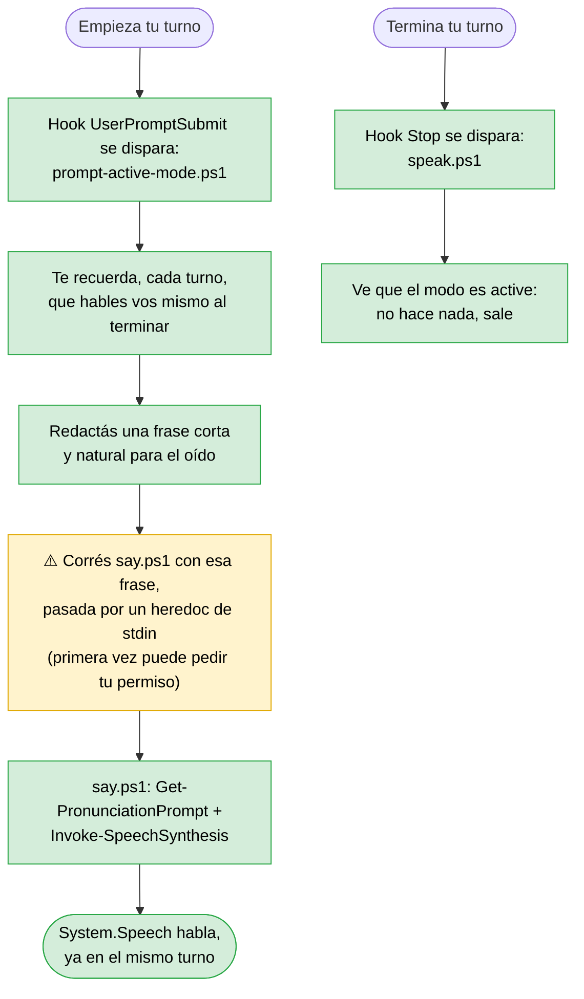

# Arquitectura de sapi-voice-kit

Detalle técnico de qué componente hace qué en cada uno de los cuatro modos de lectura — para instalación, comandos, y una descripción general, ver el [README](README.md).

## Qué corre en cada modo, componente por componente

Cada modo usa una combinación distinta de piezas. Los cuadros verdes son 100% locales e instantáneos; los amarillos son el único punto de cada modo que cuesta algo extra (uso de tu cuenta, tiempo de espera, o un permiso que aprobar).

### Modo `natural` (el que viene activado por defecto)

Todo local, todo instantáneo. Ningún componente sale de tu máquina.

### Modo `literal`

El modo más simple: cero procesamiento, cero componentes extra.

### Modo `summary`

El único de los cuatro que sale de tu máquina hacia una llamada de Claude — por eso no viene activado por defecto. Si esa llamada falla por lo que sea, nunca te quedás sin nada: cae al comportamiento del modo natural.

### Modo `active`

El más rápido de los cuatro (nada de esperar a una llamada aparte), pero el único que le pide permiso a Claude Code — porque acá el que corre el comando es el modelo mismo, no un hook automático. Fíjate que el hook `Stop` (abajo del diagrama) sigue disparándose igual que en los otros modos, pero se queda quieto a propósito — así nunca se superponen las dos formas de hablar.
