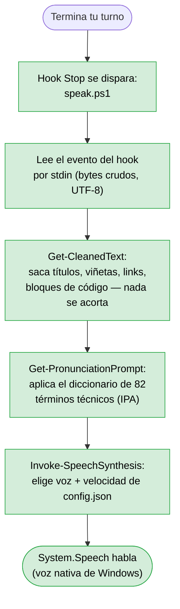
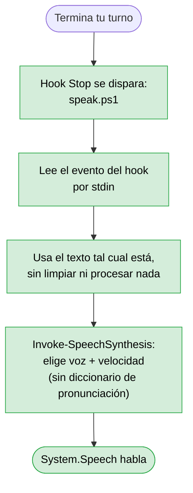
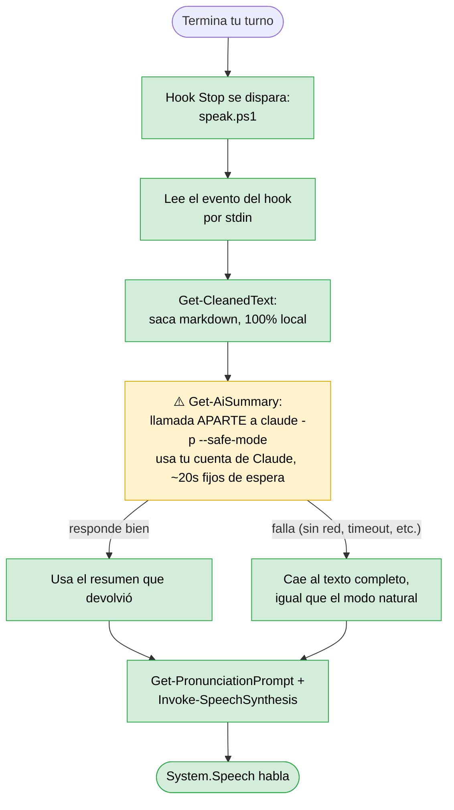
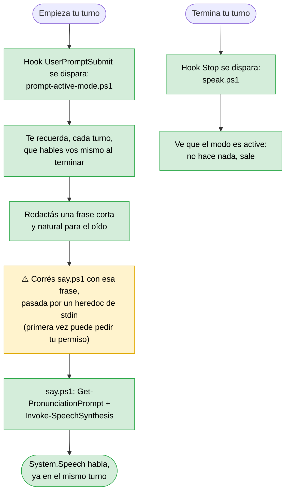

# sapi-voice-kit

Hablá con **Claude Code** en vez de leerlo. Escribí o dictá tu mensaje, y en vez de leer la respuesta en pantalla, escuchala — la respuesta completa, limpia para que suene como habla y no como un documento leído, no una leyenda y no un resumen recortado por las dudas. Sin API keys, sin Python, sin instaladores externos: usa la síntesis de voz nativa de Windows (`System.Speech` / SAPI), que ya viene con el sistema operativo.

Pensado para gente a la que le cuesta leer en pantalla, o para cualquiera que prefiera escuchar mientras trabaja. La respuesta en pantalla nunca se toca — esto solo afecta lo que escuchás.

## Por qué existe

Ya hay varios proyectos de voz para Claude Code, pero casi todos apuntan a macOS, o piden instalar Python/Node y conseguir una API key de algún proveedor de voz (edge-tts, ElevenLabs, Deepgram, Piper...). `sapi-voice-kit` es distinto: **un solo plugin, cero dependencias externas, cero instalador** — si tenés Windows, ya tenés todo lo que hace falta.

## Qué hace

- Lee en voz alta cada respuesta de Claude Code automáticamente, apenas termina cada turno.
- **Modo natural (por defecto):** lee la respuesta completa, limpia de markdown (encabezados, viñetas, links, sintaxis de código) para que suene como habla y no como un documento leído. No se acorta ni se omite nada — la respuesta en pantalla nunca se toca, esto solo afecta lo que se escucha.
- **Modo literal:** escuchás la respuesta tal cual está escrita, sin ninguna limpieza — útil sobre todo para revisar qué dice el texto crudo.
- **Modo resumen (`summary`):** escuchás un resumen real y condensado en vez de la respuesta completa — tarda unos 20 segundos más por respuesta (le pide el resumen a Claude aparte), así que es opcional, no viene activado por defecto.
- **Modo activo (`active`):** el modelo mismo dice una frase corta y natural, en el mismo turno — sin archivos, sin demora extra de una llamada aparte. Es el que más natural y rápido suena, pero la primera vez que se usa en una sesión, Claude Code te va a pedir permiso para correr el comando (ver la sección de Instalación más abajo para saltear ese cartel de una vez si querés).
- Detecta automáticamente una voz instalada que coincida con el idioma de tu sistema (en vez de venir fija en un idioma). Se puede cambiar a mano.
- Términos de programación comunes (`git`, `commit`, `config`, `hook`, `function`, y unos 80 más) se pronuncian correctamente en inglés aunque estén en medio de una oración en otro idioma, usando la misma voz de siempre — no una segunda voz que corta la frase.

## Instalación

### Recomendado: como plugin

```
/plugin marketplace add https://github.com/maurorusso/sapi-voice-kit
/plugin install sapi-voice-kit
```

(Usar la URL completa con `https://` evita que Claude Code intente clonar por SSH por defecto, lo cual falla en máquinas sin una clave SSH de GitHub configurada. La forma corta `maurorusso/sapi-voice-kit` también funciona, pero solo si ya tenés acceso SSH a GitHub configurado.)

### Para probarlo sin instalar nada (desarrollo)

```bash
claude --plugin-dir "/ruta/a/sapi-voice-kit"
```

Carga el plugin solo para esa sesión, sin tocar tu configuración.

## Uso

Una vez instalado, no hay que hacer nada más — las respuestas se empiezan a leer solas.

Comandos disponibles:

| Comando | Qué hace |
|---|---|
| `/sapi-voice-kit:voice` | Lista las voces instaladas en Windows |
| `/sapi-voice-kit:voice <nombre>` | Fuerza una voz específica |
| `/sapi-voice-kit:voice <idioma>` | Fuerza un idioma (ej. `en-US`) |
| `/sapi-voice-kit:voice auto` | Vuelve a la detección automática de voz |
| `/sapi-voice-kit:voice <faster/slower>` | Ajusta la velocidad de lectura |
| `/sapi-voice-kit:mode natural` | (por defecto) Lee la respuesta completa, limpia para que suene como habla |
| `/sapi-voice-kit:mode literal` | Lee la respuesta completa exactamente como está escrita |
| `/sapi-voice-kit:mode summary` | Lee un resumen condensado (~20s más lento por respuesta) |
| `/sapi-voice-kit:mode active` | El modelo dice una frase corta él mismo, en el momento (puede pedir permiso la primera vez) |
| `/sapi-voice-kit:debug on` / `off` | Prende o apaga los archivos de log para diagnóstico (apagado por defecto) |

### Sobre el permiso del modo `active`

Este modo hace que el modelo corra un comando para hablar, así que la primera vez en cada sesión Claude Code te va a preguntar si lo autorizás — es el comportamiento normal y esperado, no un error, y **el plugin no puede saltear ese permiso por su cuenta** (ni debería: que un plugin se auto-otorgue permisos sería un problema de seguridad, no algo a resolver).

Cuando te aparezca el cartel, elegí "permitir siempre" para no verlo de nuevo en esa sesión. Si preferís saltearlo directamente desde el principio, podés agregar vos mismo una regla a tu `.claude/settings.json` (nunca es algo que el plugin haga por vos):

```json
{
  "permissions": {
    "allow": ["Bash(powershell*say.ps1*)"]
  }
}
```

(La regla exacta puede variar según tu versión de Claude Code — cuando te aparezca el cartel de permiso la primera vez, fijate qué regla te ofrece agregar y usá esa si es distinta a la de arriba.)

## Privacidad: qué se guarda en disco, y cuándo

**Por defecto, este plugin no escribe absolutamente nada** en tu máquina más allá de la configuración que vos mismo elegís a propósito (`/sapi-voice-kit:voice`, `/sapi-voice-kit:mode`). No queda ningún archivo con una copia de lo que se dijo, ni logs, nada — ni siquiera se crea la carpeta de datos hasta que cambiás alguna preferencia.

Los archivos de log (`log-speak.txt`, y una copia del último texto leído en `last-text.txt`) **solo existen si vos los pedís explícitamente** con `/sapi-voice-kit:debug on`, para diagnosticar un problema puntual. Incluso con eso prendido, cada log tiene un tope de tamaño (se recorta solo a las últimas 200 líneas) — no crece para siempre. Se recomienda volver a apagarlo (`/sapi-voice-kit:debug off`) una vez resuelto lo que sea que estabas viendo.

## Arquitectura: qué instala, dónde, y qué archivos toca

### Todo lo que el plugin pone en tu disco — dos carpetas, nada más

Cuando instalás el plugin, Claude Code crea **exactamente dos carpetas**, las dos dentro de tu carpeta de usuario de Windows. No se registra nada en "Programas y características", no se toca el `PATH`, no se instala ningún servicio, no se modifica ningún otro programa:

1. **El código del plugin** — una copia clonada de este repositorio de GitHub, tal cual, sin modificar:
   ```
   %USERPROFILE%\.claude\plugins\marketplaces\sapi-voice-kit\
   ```
   Ahí están los archivos `.ps1` (`speak.ps1`, `say.ps1`, `common.ps1`, etc.), los `SKILL.md`, y el manifiesto del plugin. Esto es de solo lectura en la práctica — el plugin nunca se escribe a sí mismo.

2. **Tu configuración**, separada del código a propósito (para que sobreviva cuando el plugin se actualiza):
   ```
   %USERPROFILE%\.claude\plugins\data\sapi-voice-kit-sapi-voice-kit\
   ```
   Ahí vive **un solo archivo por defecto**, `config.json`, con la voz/idioma/modo/velocidad que elegiste — y ni siquiera ese archivo existe hasta que corrés `/sapi-voice-kit:voice` o `/sapi-voice-kit:mode` por primera vez. Si activás `/sapi-voice-kit:debug on`, ahí también aparecen `log-speak.txt`, `log-say.txt` y `last-text.txt` — ver la sección de Privacidad más arriba para el detalle de cuándo y por qué.

### ¿Usa alguna carpeta temporal? No — ninguna, en ningún modo

Es una pregunta que vale la pena responder explícitamente: **el plugin no escribe, en ningún momento, a `%TEMP%`, `C:\Windows\Temp`, ni ningún otro directorio temporal.** El texto que se lee en voz alta viaja siempre por memoria (stdin/stdout entre procesos), nunca pasa por un archivo intermedio — ni uno que se borre después, directamente no existe ese archivo en ningún punto del proceso. Esto fue una decisión deliberada (ver Privacidad arriba): se evaluó incluso la idea de un archivo que se autoborre al toque, y se descartó en favor de no escribir nada de entrada, que es más seguro todavía.

La única excepción real: en modo `summary`, la llamada `claude -p` es un proceso de Claude Code aparte, y ese proceso puede usar sus propios archivos temporales internos como cualquier sesión normal de Claude Code — eso está fuera del control de este plugin, es el mismo comportamiento que tendría cualquier uso tuyo de Claude Code sin el plugin de por medio.

### Qué corre en cada modo, componente por componente

Cada modo usa una combinación distinta de piezas. Los cuadros verdes son 100% locales e instantáneos; los amarillos son el único punto de cada modo que cuesta algo extra (uso de tu cuenta, tiempo de espera, o un permiso que aprobar).

#### Modo `natural` (el que viene activado por defecto)



Todo local, todo instantáneo. Ningún componente sale de tu máquina.

#### Modo `literal`



El modo más simple: cero procesamiento, cero componentes extra.

#### Modo `summary`



El único de los cuatro que sale de tu máquina hacia una llamada de Claude — por eso no viene activado por defecto. Si esa llamada falla por lo que sea, nunca te quedás sin nada: cae al comportamiento del modo natural.

#### Modo `active`



El más rápido de los cuatro (nada de esperar a una llamada aparte), pero el único que le pide permiso a Claude Code — porque acá el que corre el comando es el modelo mismo, no un hook automático. Fíjate que el hook `Stop` (abajo del diagrama) sigue disparándose igual que en los otros modos, pero se queda quieto a propósito — así nunca se superponen las dos formas de hablar.

## Cómo funciona (para curiosos)

- La pronunciación de términos técnicos comunes usa `PromptBuilder.AppendTextWithPronunciation` con fonemas IPA reales, sobre la *misma* voz elegida en los cuatro modos (salvo literal) — cambiar a una segunda voz instalada para esto se probó y se descartó (funciona, pero suena a dos personas distintas hablando, y casi duplica el tiempo de lectura en respuestas con mucho código).
- La configuración (voz, idioma, modo) se guarda en la carpeta de datos propia del plugin, así que sobrevive a las actualizaciones. No se escribe nada más salvo que actives el modo debug (ver "Privacidad" arriba).

Nada sale de tu máquina salvo en modo `summary` (llamada a Claude) y modo `active` (el propio modelo, que ya está corriendo en tu sesión de Claude Code): no hay servicios de terceros, no hay API keys propias del plugin, no hay telemetría.

## Requisitos

- Windows (usa `System.Speech`, que es específico de Windows).
- Claude Code.

## Aviso

Este es un proyecto de la comunidad, no afiliado con Anthropic ni respaldado por Anthropic. "Claude" y "Claude Code" son marcas de Anthropic, usadas acá solo para describir con qué es compatible este plugin.

## Licencia

MIT — ver [LICENSE](LICENSE).
